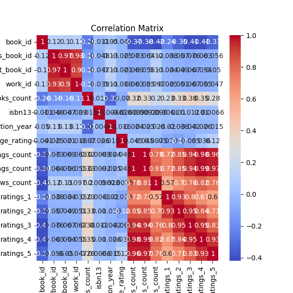

# Analysis Report

### Dataset Summary

The dataset consists of 10,000 entries and 23 columns related to books, primarily gathered from Goodreads. Here’s a structured breakdown:

1. **Core Identifiers**: Each book is uniquely identified with columns such as `book_id`, `goodreads_book_id`, `best_book_id`, and `work_id`.

2. **Attributes**: 
   - **Publishing Information**: Includes `original_publication_year`, `isbn`, and `isbn13`, with several missing values in `isbn` (700 missing) and `isbn13` (585 missing).
   - **Content Details**: Attributes like `authors`, `original_title`, and `title` provide essential information about each book.
   - **Ratings Information**: This is captured through columns such as `average_rating`, `ratings_count`, and detailed breakdowns of rating distributions (`ratings_1` to `ratings_5`).

3. **Language Information**: The dataset reflects language diversity with the `language_code` attribute, though there are some missing values (1,084 missing).

4. **Statistical Summary**: 
   - There are established descriptive statistics for numerical fields, such as `average_rating` (mean = 4.00) and `ratings_count` (mean = 54,001). The standard deviation in rating counts suggests a wide range of user engagement for different books.
   - The `books_count` column (mean = 75.71) suggests possible repetitions or different editions of works by the same author.

5. **Missing Values**: Primarily seen in columns related to `isbn`, `original_publication_year`, `original_title`, and `language_code`, which could impact certain analyses.

6. **Correlation Insights**: 
   - Strong correlations exist between the ratings categories, especially between `ratings_count` and the breakdowns of `ratings_1` to `ratings_5`.
   - The `work_ratings_count` shows a strong correlation with `ratings_count`, indicating that the number of ratings is closely linked with user involvement and possibly quality perception.

7. **Visualizations**: Distribution plots for the unique identifiers and a correlation matrix were generated, providing visual insights into the data distribution and relationships between variables.

### Key Insights

1. **User Engagement**: High ratings counts paired with high average ratings suggest that there is a subset of popular books with substantial user interaction. Books like those by Stephen King (the most frequently mentioned author) likely have high visibility and engagement.

2. **Missing Information**: The substantial missing values, particularly in ISBN and language codes, highlight areas that could be improved in data collection processes. This could potentially affect the analysis of genre or market trends.

3. **Publication Trends**: The original publication year averages imply that many entries are contemporary. This reflects either a focus on recent publications or a skewed dataset that emphasizes newer literature.

4. **Authors’ Influence**: The presence of a few highly-rated authors indicates that a small number of individuals drive a significant portion of the data, suggesting that popularity may be clustered around a few key players.

### Implications

1. **Recommendation Systems**: The correlations between ratings suggest that improving recommendation algorithms on platforms, such as Goodreads, could leverage user rating data to enhance user experience.

2. **Data Gaps and Improvements**: Addressing missing values and ensuring completeness in key identifiers like ISBNs and language codes can significantly enhance the quality and usability of the dataset.

3. **Market Analysis**: Understanding the distribution of ratings can help publishers and authors strategize marketing efforts, possibly encouraging them to focus on generating more reviews for their titles.

4. **Further Research**: The dataset provides a fertile ground for further research, including sentiment analysis on reviews in conjunction with ratings, exploring how they correlate to work quality or user demographics.

In conclusion, this dataset encapsulates valuable insights into the reading habits and preferences of Goodreads users, along with critical gaps that require attention for more robust analytical outcomes.

