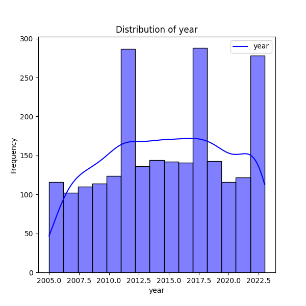
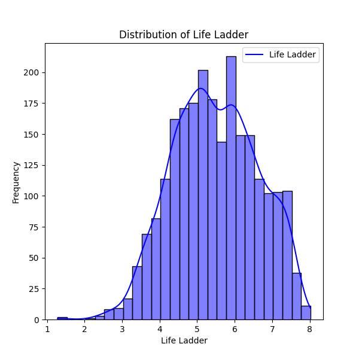
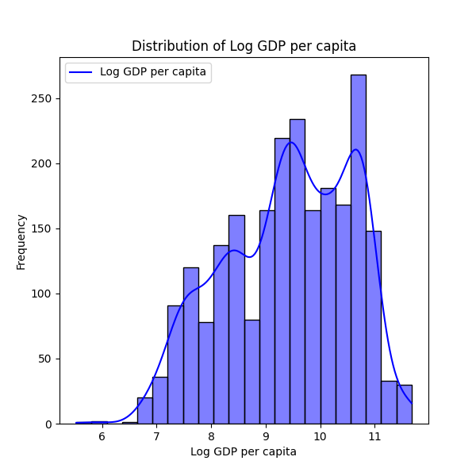
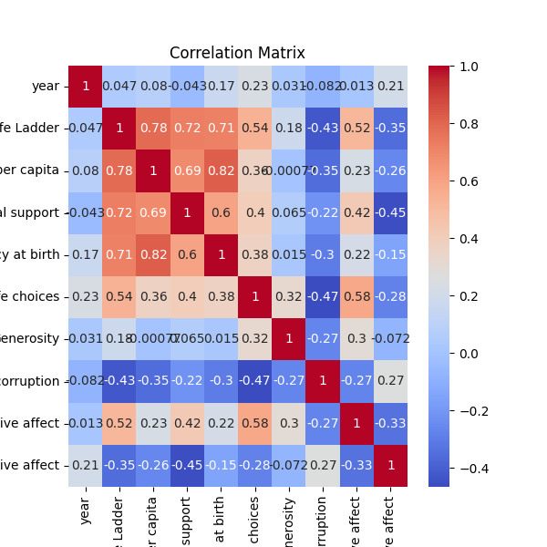

# Analysis Report

### Summary of the Dataset

The dataset consists of 2,363 records with 11 columns that provide information about various factors affecting happiness across different countries and years from 2005 to 2023. Key columns include metrics such as 'Life Ladder', 'Log GDP per capita', 'Social support', and others that aim to quantify the subjective well-being of individuals in relation to economic and social factors.

#### Key Insights

1. **Life Ladder**:
   - The average 'Life Ladder' score is approximately 5.48, with a standard deviation of 1.13, indicating variability in happiness levels among the countries included in the dataset. The minimum score is 1.281, while the maximum is 8.019.

2. **Economic Measurement**:
   - The mean 'Log GDP per capita' is around 9.40, indicating a range of economic conditions across the countries. The correlation between 'Log GDP per capita' and 'Life Ladder' is strong (r = 0.78), suggesting that higher economic output is associated with higher levels of reported happiness.
   - Notably, there are 28 missing values in 'Log GDP per capita', which may bias analyses if not addressed.

3. **Social Factors**:
   - 'Social support' has a mean of approximately 0.81, and shows a strong positive correlation with 'Life Ladder' (r = 0.72), reinforcing the idea that social connections and community support significantly affect individual happiness.
   - The average scores for 'Freedom to make life choices' and 'Positive affect' are around 0.75 and 0.65 respectively, suggesting that personal autonomy and positive emotional experiences are also important components of well-being.

4. **Negative Affect**:
   - 'Negative affect' has an average of about 0.27, with a significant negative correlation (r = -0.35) with 'Life Ladder', indicating that higher levels of negative feelings are linked to lower life satisfaction.

5. **Perceptions of Corruption**:
   - The average score for 'Perceptions of corruption' is approximately 0.74. There is a notable negative correlation with 'Life Ladder' (r = -0.43), suggesting that a higher perception of corruption is associated with decreased well-being.

6. **Healthy Life Expectancy**:
   - 'Healthy life expectancy at birth' shows a mean score of approximately 63.4 years, and it also correlates positively with 'Life Ladder' (r = 0.71), underscoring the relationship between health and happiness.

### Missing Values
There are several columns with missing values, particularly for 'Generosity' (81 missing) and 'Perceptions of corruption' (125 missing). This could affect the robustness of analyses and interpretations derived from the dataset.

### Visualizations
The datasets and relationships are accompanied by visualizations, such as:
- Distribution of happiness ('Life Ladder') over the years.
- GDP distribution reflecting economic disparities.
- A correlation matrix visualizing inter-variable relationships to quickly identify which factors have stronger influences on happiness.

### Implications

1. **Policy Formulation**: 
   - Policymakers should focus on enhancing economic conditions, improving social support networks, and reducing corruption to drive improvements in happiness metrics.
   - Health initiatives promoting healthy aging can also improve the overall life satisfaction reported within populations.

2. **Further Research**:
   - Future studies should consider longitudinal data analytics to observe trends over time, especially with missing data. This will help understand how improvements or declines in economic and social factors potentially influence happiness.
   - Investigating the impacts of cultural differences on the perceptions of happiness and support could provide deeper insights into life satisfaction across diverse populations.

3. **Community Interventions**: 
   - Organizations focused on mental health and community integration could use these insights to design impactful programs that address social connectivity and community well-being, particularly in areas reporting lower happiness scores.

4. **Data Completeness**: 
   - It may be beneficial to fill in or address the missing data to leverage more robust statistical analyses, potentially utilizing appropriate imputation methods or focusing on conducting sensitivity analyses to understand the potential biases introduced by the missing values.

Overall, this dataset serves as a rich foundation to explore the multifaceted nature of happiness and well-being, highlighting the intricate interplay between economic, social, and health factors.

