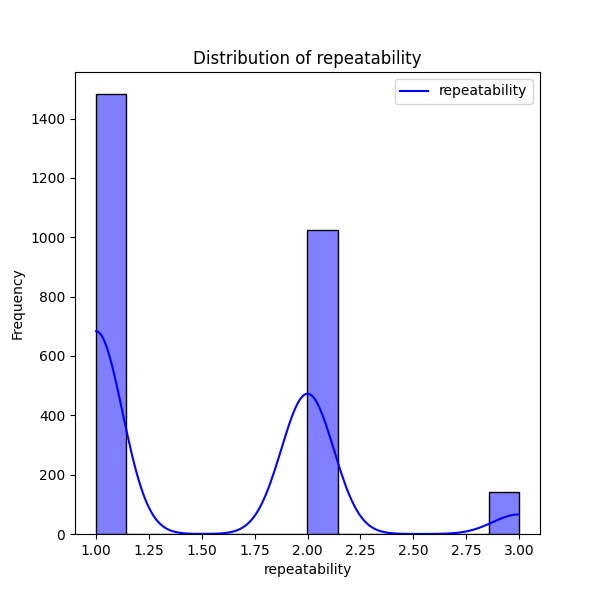

# Analysis Report

### Dataset Summary

The dataset consists of 2,652 entries, each representing a media review with 8 attributes: `date`, `language`, `type`, `title`, `by`, `overall`, `quality`, and `repeatability`. 

#### Key Attributes:
- **Date**: Indicates when each review was made. There are 99 missing values in this column.
- **Language**: Total of 11 unique languages, with 'English' being the most frequent (1,306 occurrences).
- **Type**: 8 unique media types, with 'movie' being predominant (2,211 occurrences).
- **Title**: Represents the name of the media reviewed, with a total of 2,312 unique titles. The title 'Kanda Naal Mudhal' has the highest frequency (9).
- **By**: Denotes the reviewer, with 2390 entries and 1528 unique reviewers. 'Kiefer Sutherland' is the most frequent reviewer (48 reviews).
- **Overall Rating**: Numeric ratings on a scale of 1 to 5, with a mean of 3.05 and a standard deviation of 0.76. Ratings are reasonably normally distributed, with no extreme outliers.
- **Quality Rating**: Similar to overall, with a mean of 3.21 and standard deviation of 0.80, indicating a slightly higher assessment relative to overall ratings. 
- **Repeatability**: Ratings indicate how likely the reviewer is to recommend the media again, with a mean of 1.49 and a range showing low repeatability ratings.

### Missing Values
- The `date` column has a considerable number of missing values (99).
- The `by` (review author) column has 262 missing values, which could impact the analysis related to reviewer influence on ratings.

### Key Insights

1. **Distribution of Ratings**: The overall and quality ratings appear skewed towards the median, suggesting that most reviews rate their media around 3, with few venturing into the extremes.

2. **Reviewer Influence**: There is a significant number of unique titles and reviewers indicating a diverse set of feedback. However, the substantial missing values in the `by` column may limit the analysis of individual reviewer trends or patterns.

3. **Correlation**: The correlation matrix suggests strong relationships:
   - **Overall with Quality (0.826)**: Indicates that as the quality rating increases, so does the overall rating, showing that reviewers base their overall impressions largely on perceived quality.
   - **Overall with Repeatability (0.513)**: Moderate correlation suggests that overall enjoyment relates somewhat to the likeliness of recommending the media again.
   - **Quality with Repeatability (0.312)**: Weaker correlation highlights that higher quality doesn’t necessarily result in a higher intention to repeat.

4. **Linguistic and Type Insights**: The predominance of English-language media and movies indicate possible biases in the dataset that may not represent global ratings.

### Implications

1. **Data Quality Improvement**: Addressing missing values in `date` and `by` will enhance the dataset's usability. Implementing methods to fill or remove missing data can yield better results in the analysis.

2. **Targeted Recommendations**: With the identified strong correlation between overall and quality ratings, media distributions could be targeted towards higher-quality genres. Media managers could focus on improving quality to boost overall reception.

3. **Diversity in Reviewers**: Encouragement of more diverse reviewers could lead to richer insights and broaden the analysis for better understanding of audience demographics.

4. **Recommendation Strategies**: Since repeatability is moderately correlated with overall enjoyment, using strategies to enhance viewer satisfaction could potentially increase repeat viewing and recommendations.

5. **Further Exploration**: Extra analysis into the relationships between media types, languages, and their ratings could uncover valuable insights about audience preferences and cultural influences.

In conclusion, while the dataset provides a robust basis for analysis, addressing its gaps and leveraging the existing correlations will provide deeper insights into media consumption and reviewer behavior.

